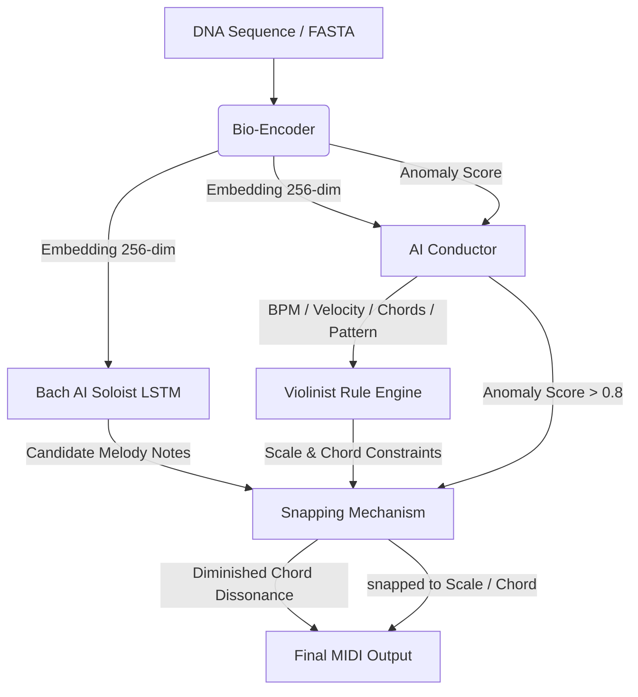
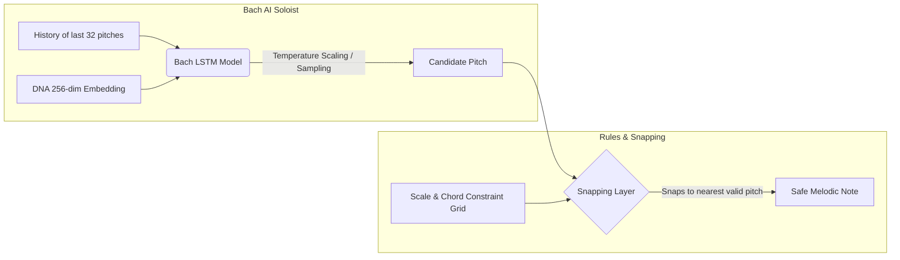
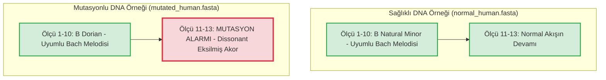

ÖZET
Bu çalışma, DNA dizilerinin solo piyano estetiğinde sembolik müzik çıktısına dönüştürülmesini hedefleyen Bio-Conductor adlı hibrit bir DNA-to-Music mimarisini sunmaktadır. Önerilen sistem, deterministik kural tabanlı müzik motoru ile DNA koşullu derin öğrenme bileşenlerini birlikte kullanır. DNA dizileri 300 bazlık pencereler halinde işlenir; SHA-256 tabanlı kriptografik kimlik çıkarımı ile tonik ve mod belirlenir; pürin oranı, GC içeriği, enerji ve anomali skoru gibi biyolojik/istatistiksel özellikler tempo, akor progresyonu, pattern, velocity ve mutasyon alarmı kararlarına dönüştürülür. Kural tabanlı motor müzikal uyumu garanti ederken, DNA koşullu Bach LSTM bileşeni mekanikliği azaltan yaratıcı bir melodi katmanı üretir. AI tarafından önerilen notalar snapping mekanizmasıyla seçili gam ve akor bağlamına hizalanır; anomali skoru eşik üstüne çıktığında sistem eksilmiş akor tabanlı mutasyon alarmı üretir. Final raporunda kısa literatür taraması, kullanılan kaynakların sisteme dönüşümü, Bio-Conductor mimarisi, kural seti, deney senaryoları ve sağlıklı/mutasyonlu DNA örneklerinin karşılaştırmalı sonuçları sunulmaktadır.
Anahtar kelimeler: DNA sonifikasyonu, Bio-Conductor, kural tabanlı müzik üretimi, DNA koşullu LSTM, solo piyano, mutasyon alarmı, MIDI.

DIRECT TRANSLATION FROM DNA SEQUENCES TO SYMBOLIC MUSIC: BIO-CONDUCTOR BASED HYBRID AI TRANSLATION MODEL
ABSTRACT
This study presents Bio-Conductor, a hybrid DNA-to-Music architecture designed to transform DNA sequences into aesthetic symbolic solo piano music. The proposed system combines a deterministic rule-based music engine with DNA-conditioned deep learning components. DNA sequences are processed in 300-base windows; SHA-256 based cryptographic identity extraction determines the tonic and mode; biological/statistical features such as purine ratio, GC content, energy and anomaly score are mapped to tempo, chord progression, texture pattern, velocity and mutation alarm decisions. While the rule-based engine guarantees musical stability, the DNA-conditioned Bach LSTM component produces a more creative melodic layer. Notes proposed by the AI model are aligned to the active scale and chord context by a snapping mechanism; when the anomaly score exceeds the threshold, the system triggers a diminished-chord-based mutation alarm. This final report presents a focused literature review, the transformation of literature contributions into system design, the Bio-Conductor architecture, the complete rule set, experiment scenarios, and comparative results for healthy and mutated DNA examples.
Keywords: DNA sonification, Bio-Conductor, rule-based music generation, DNA-conditioned LSTM, solo piano, mutation alarm, MIDI.

İÇİNDEKİLER
Sayfa No
ÖZET ................................................................................. ii
ABSTRACT ............................................................................. iii
İÇİNDEKİLER .......................................................................... iv
ŞEKİLLER DİZİNİ ...................................................................... vi
ÇİZELGELER DİZİNİ .................................................................... vii
1. GİRİŞ ............................................................................. 1
1.1. Konunun önemi ve problem tanımı ................................................. 1
1.2. Çalışmanın amacı ve kapsamı ..................................................... 1
1.3. Projenin özgün değeri ........................................................... 2
2. KAYNAK ARAŞTIRMASI ................................................................ 3
2.1. Kısa literatür taraması ......................................................... 3
2.2. Bu projede doğrudan kullanılan literatür katkıları .............................. 4
2.3. Literatür boşluğu ve konumlandırma .............................................. 4
3. MATERYAL VE YÖNTEM ................................................................ 5
3.1. Girdi verisi ve ön işleme ....................................................... 5
3.2. Bio-Conductor mimarisi .......................................................... 5
3.3. Bio-Encoder: biyolojik verinin sayısal temsili .................................. 6
3.4. Kural tabanlı klasik müzik motoru (The Violinist) ............................... 6
3.5. Conductor: biyolojik kontrol sinyallerinden müzikal karar üretimi ............... 7
3.6. DNA-koşullu Bach AI Soloist ..................................................... 7
3.7. Snapping mekanizması ve mutasyon alarmı ......................................... 8
3.8. Çıktı formatı ve izlenebilirlik ................................................. 9
4. ARAŞTIRMA SONUÇLARI ............................................................... 10
4.1. Genel sistem çıktısı ............................................................ 10

4.2. Sağlıklı DNA örneği sonucu ...................................................... 10
4.3. Mutasyonlu DNA örneği sonucu .................................................... 10
4.4. Karşılaştırmalı değerlendirme ................................................... 11
4.5. Başarılan hedefler .............................................................. 11
5. TARTIŞMA .......................................................................... 13
5.1. Bulguların anlamı ............................................................... 13
5.2. Literatür ile karşılaştırma ..................................................... 13
5.3. Metodolojik güçlü yönler ........................................................ 13
5.4. Sınırlılıklar ................................................................... 13
5.5. Gelecek çalışmalar .............................................................. 14
6. SONUÇ ............................................................................. 15
7. EKLER ............................................................................. 16
8. KAYNAKÇA .......................................................................... 17
9. TEŞEKKÜR VE ÖZGEÇMİŞ .............................................................. 18

ŞEKİLLER DİZİNİ
Sayfa No
Şekil 3.1. Bio-Conductor / Split Brain sistem mimarisi .......................... 5
Şekil 3.2. DNA-koşullu Bach AI ve snapping mekanizması .......................... 8
Şekil 4.1. Sağlıklı ve mutasyonlu DNA deney karşılaştırması ..................... 11

ÇİZELGELER DİZİNİ
Sayfa No
Çizelge 2.1. Kısa literatür taraması ve bu projede kullanılan ana katkılar ...... 3
Çizelge 2.2. Literatürden türetilen tasarım kararları ........................... 4
Çizelge 3.1. Bio-Conductor modülleri ve görevleri ............................... 5
Çizelge 3.2. Biyolojik özelliklerden müzikal parametrelere eşleme ............... 6
Çizelge 3.3. Kural tabanlı motorun temel parametreleri .......................... 7
Çizelge 3.4. Conductor kararları ve anomali eşikleri ............................ 7
Çizelge 4.1. Sağlıklı ve mutasyonlu DNA çıktılarının karşılaştırması ............ 11
Çizelge 4.2. Başarılan hedefler ve raporlanan gözlemler ......................... 12
1. GİRİŞ
1.1. Konunun önemi ve problem tanımı
DNA dizileri, canlılara ait kalıtsal bilginin harf dizisi biçimindeki temel temsilidir. Bu diziler geleneksel olarak metinsel, sayısal veya görsel araçlarla analiz edilmektedir. Ancak uzun DNA dizilerinde tekrarlar, küçük mutasyonlar, yoğunluk değişimleri ve anomali bölgeleri yalnızca görsel inceleme ile kolay fark edilemeyebilir. Sonifikasyon, bu noktada biyolojik veriyi işitsel bir forma dönüştürerek ek bir algı kanalı sağlar. Böylece araştırmacı, veri içindeki ani değişimleri, tekrarları veya uyumsuzlukları müzikteki ritim, perde, dinamik veya armoni değişimleri olarak duyabilir.
Bu çalışmada DNA sonifikasyonu yalnızca veri duyurumu olarak değil, dinlenebilir ve estetik bir solo piyano üretimi problemi olarak ele alınmıştır. Geleneksel DNA-to-music yaklaşımlarında sık görülen problem, biyolojik veriyi doğrudan nota dizisine çevirdiğinde çıktının kısa sürede monotonlaşması veya müzikal bütünlüğünü kaybetmesidir. Bu nedenle bu projede, biyolojik bilgi ile müzik teorisi arasında bir arabulucu katman tasarlanmıştır. Bu katman, DNA’dan gelen bilgiyi tonik, mod, tempo, akor, pattern, velocity ve anomali alarmı gibi müzikal kararlara dağıtır.
1.2. Çalışmanın amacı ve kapsamı
Projenin amacı, DNA/RNA dizilerini insanların duyabileceği, analiz edebileceği ve estetik olarak dinleyebileceği solo piyano müziğine dönüştüren hibrit bir sistem geliştirmektir. Bu sistemin temel hedefi, müzikal çıktıyı yalnızca “notalara çevrilmiş veri” olmaktan çıkarıp, biyolojik kimliği olan ve müzik teorisi açısından kontrol edilen bir besteye dönüştürmektir.
Çalışma kapsamında üç temel hedef belirlenmiştir. Birincisi, aynı DNA dizisinin her çalıştırmada aynı müzikal kimliği üretmesini sağlayan deterministik bir kural motoru kurmaktır. İkincisi, derin öğrenme bileşeni ile melodik akışın mekanikleşmesini azaltmak ve daha yaratıcı bir solo katmanı üretmektir. Üçüncüsü, anomali veya mutasyon ihtimali yüksek olan bölgelerde müzikal uyumsuzluğu bilinçli biçimde kullanarak işitsel bir uyarı mekanizması oluşturmaktır.
1.3. Projenin özgün değeri
Bio-Conductor mimarisinin özgün yönü, kural tabanlı müzik teorisi ile DNA koşullu yapay zeka üretimini ayırması ve daha sonra snapping katmanı ile güvenli biçimde birleştirmesidir. Bu yaklaşım, “Split Brain” olarak adlandırılmıştır: Kural motoru müziğin teorik sınırlarını ve tonal tutarlılığını korurken, AI Soloist katmanı yaratıcı melodik varyasyonlar üretir. Conductor katmanı ise biyolojik özelliklerden gelen kontrol sinyallerini müzikal parametrelere dönüştürür.

2. KAYNAK ARAŞTIRMASI
2.1. Kısa literatür taraması
DNA ve protein dizilerinin müziğe dönüştürülmesi üzerine yapılan ilk çalışmalar, biyolojik dizilerin alternatif bir temsil biçimi olarak müziğe aktarılabileceğini göstermiştir. Hayashi ve Munakata (1984), genetik müzik fikrinin erken örneklerinden biri olarak nükleotid ve amino asitlerin sesle temsil edilebileceğini göstermiştir. Ohno ve Ohno (1986) ise DNA’daki tekrar yapılarını müzikal tekrar fikriyle ilişkilendirerek biyolojik dizi ile müzikal motif arasındaki düşünsel bağı güçlendirmiştir.
King ve Angus (1996), protein dizilerinin çok katmanlı biçimde müzikleştirilmesi açısından önemli bir öncül sunmuştur. Takahashi ve Miller (2007), doğrudan amino asit-nota eşlemesinin müzikal sıçrama ve tutarsızlık üretebileceğini göstererek azaltılmış alfabe ve kısıtlı eşleme fikrinin önemini ortaya koymuştur. Temple (2017, 2024), DNA sonifikasyonunda okuma çerçevesi, kodon, GC içeriği, çok kanallı ses ve MIDI çıktısı gibi bileşenleri bir araya getirerek bu projenin kural tabanlı katmanları için yakın metodolojik temel sağlamaktadır.
Yapay zeka tarafında Yu ve diğerleri (2019), sonifikasyon ile yapay zekayı birleştirerek biyolojik dizilerden öğrenilebilir müzikal temsiller üretme fikrini desteklemiştir. DeepBach ve Music Transformer gibi sembolik müzik üretimi çalışmaları, uzun bağlam, armoni tutarlılığı ve insan-anlaşılır müzikal yapıların öğrenilmesi açısından önemli referanslardır. MusPy ise üretilen MIDI çıktılarının scale consistency, pitch-class entropy ve empty beat rate gibi objektif metriklerle değerlendirilmesine olanak tanır.
Çizelge 2.1’de, final sistemde doğrudan kullanılan literatür katkıları özetlenmiştir.
Çizelge 2.1. Kısa literatür taraması ve bu projede kullanılan ana katkılar
Kaynak	Ana fikir	Bu projede kullanılan kısım
Hayashi ve Munakata (1984)	Genetik dizilerin müzikal temsil fikri	DNA sonifikasyonunun tarihsel/temel motivasyonu
Ohno ve Ohno (1986)	DNA tekrarı ve müzikal tekrar ilişkisi	Motif/tekrar kavramının biyolojik zemini
King ve Angus (1996)	Çok katmanlı protein-müzik eşleme	Perde, ritim, dinamik ve doku katmanlarının ayrılması
Takahashi ve Miller (2007)	Azaltılmış alfabe ve aralık kontrolü	Snapping ve gam içi hareket kuralı
Temple (2017/2024)	Kodon, frame, GC ve MIDI tabanlı sonifikasyon	Pencereleme, çok katmanlı veri-müzik akışı
Fesenmeier (2015)	Biyokimyasal sınıflardan harmony kararları	Kimyasal grup → kök ses/akor kararları
Yu vd. (2019)	Sonifikasyon ve AI birleşimi	Hibrit AI DNA-to-Music yaklaşımı
DeepBach / Music Transformer	Müzikal bağlam öğrenme	Bach LSTM ve AI Soloist gerekçesi
MusPy (Dong vd., 2020)	MIDI metrikleri	scale consistency, pitch entropy, empty beat rate planı

2.2. Bu projede doğrudan kullanılan literatür katkıları
Literatürdeki çalışmalar yalnızca kaynakça olarak değil, sistem tasarımına dönüştürülen teknik kararlar olarak kullanılmıştır. Özellikle “tek parametreye yığmama”, “gam içi kısıtlama”, “çok katmanlı çıktı”, “AI ile yaratıcılık”, “deterministik izlenebilirlik” ve “müzikal değerlendirme” fikirleri sistemin temelini oluşturmuştur. Çizelge 2.2’de bu dönüşüm özetlenmiştir.
Çizelge 2.2. Literatürden türetilen tasarım kararları
Literatür dersi	Sistemdeki karşılığı	Amaç
Biyolojik bilgi tek notaya indirgenmemelidir.	Bio-Encoder + Violinist + Conductor katmanları	Bilgiyi perde, akor, tempo, pattern ve velocity’ye dağıtmak
Müzikalite için kısıt gerekir.	Snapping mekanizması	AI notasını seçili gam/akor alanına hizalamak
Tekrar hem bilgi hem de monotonluk kaynağıdır.	AAA yasağı + kopya ölçü engeli	Motif korunsun, mekanik tekrar azalsın
AI yaratıcılık sağlayabilir fakat kontrolsüz kalmamalıdır.	DNA-koşullu Bach AI + Rule Engine	Yaratıcılık ve müzik teorisini birleştirmek
Anomali duyulur hale getirilebilir.	Mutation Alarm / diminished chord	Mutasyon bölgelerini işitsel uyarıya çevirmek

2.3. Literatür boşluğu ve konumlandırma
İncelenen çalışmaların çoğu ya doğrudan kural tabanlı sonifikasyona ya da genel amaçlı sembolik müzik üretimine odaklanmaktadır. Bu projede ise biyolojik veri özellikleri, deterministik müzik teorisi, DNA koşullu AI ve mutasyon alarmı aynı mimaride birleştirilmiştir. Bu nedenle sistem, yalnızca DNA’dan müzik üretme değil, aynı zamanda DNA’daki biyolojik değişimleri müzikal davranış değişimlerine bağlama hedefi taşımaktadır.

3. MATERYAL VE YÖNTEM
3.1. Girdi verisi ve ön işleme
Sistem üç tür girdi alabilecek şekilde tasarlanmıştır: ham DNA dizisi (ACGT), yerel FASTA dosyası veya NCBI üzerinden çekilen gerçek genom/veri kaydı. Girdi dizi temizlenir, standart olmayan karakterler kontrol edilir ve 300 bazlık pencerelere ayrılır. Her pencere, müzikal zaman ekseninde bir ölçüye karşılık gelir. Böylece DNA’daki yerel değişimler ölçü düzeyinde duyulabilir hale gelir. Yapılan sağlıklı ve mutasyonlu DNA deneylerinde, hedeflenen 13 ölçülük çıktıyı elde etmek için sistem süresi 30 saniye (`--duration-seconds 30`) olarak ayarlanmıştır.
3.2. Bio-Conductor mimarisi
Bio-Conductor mimarisi, “Split Brain” yaklaşımına dayanır. Bu yaklaşımda sanat üretimi ile müzik teorisi kontrolü birbirinden ayrılır. Kural tabanlı motor müzikal güvenliği ve tonal tutarlılığı sağlar; AI Soloist daha yaratıcı melodik öneriler üretir; Conductor katmanı ise biyolojik sinyalleri müzikal kontrollere dönüştürür. Şekil 3.1’de genel sistem akışı verilmiştir.

**Şekil 3.1. Bio-Conductor / Split Brain sistem mimarisi**
Çizelge 3.1. Bio-Conductor modülleri ve görevleri
Modül	Girdi	Görev	Çıktı
Bio-Encoder	DNA penceresi	Diziyi embedding ve anomali skoruna dönüştürür	DNA vektörü + anomaly_score
The Violinist	DNA kimliği + kural seti	Tonik, mod, akor ve pattern kararlarını üretir	Kural tabanlı güvenli müzik iskeleti
Conductor	Embedding + anomaly + enerji	Tempo, velocity ve alarm gibi kontrol sinyalleri üretir	Müzikal kontrol parametreleri
AI Soloist	Bach modeli + DNA vektörü	Mekanik olmayan yaratıcı melodi önerir	Aday melodi notaları
Snapping/Alarm	AI notası + kural iskeleti	Notaları gam/akora hizalar, mutasyonda alarm üretir	Güvenli solo piyano MIDI

3.3. Bio-Encoder: biyolojik verinin sayısal temsili
Bio-Encoder, DNA penceresini yalnızca A, C, G ve T harfleri olarak değil; istatistiksel ve biyolojik özellikleri olan bir sinyal olarak işler. Bu katmanda GC oranı, pürin oranı, baz çeşitliliği, pencere karmaşıklığı ve anomali skoru hesaplanır. Daha gelişmiş mimaride CNN veya HuggingFace tabanlı genomik encoder kullanılarak DNA penceresi 256 boyutlu bir embedding vektörüne dönüştürülür. Bu embedding, AI Soloist katmanına biyolojik bağlam olarak verilir.
3.4. Kural tabanlı klasik müzik motoru (The Violinist)
The Violinist, sistemin yapay zeka olmadan da müzikal ve tutarlı çıktı üretebilen omurgasıdır. DNA’nın ilk 2400 bazı SHA-256 ile işlenerek parçanın küresel kimliği çıkarılır. İlk bölüm tonik seçimi, sonraki bölüm mod seçimi için kullanılır. Böylece aynı DNA dizisi aynı tonik/mod kimliğini üretir; tek bir harflik değişim bile kriptografik etki nedeniyle farklı müzikal kimliğe yol açabilir.
Sol el ve harmony katmanı, pürin oranı ve energy değerlerine göre akor progresyonu ve pattern seçer. Tüm notalar seçilen gamın içinde kalmak zorundadır. Bu nedenle AI veya kural motoru bir nota önerse bile, son çıktı sistem tarafından tonal olarak güvenli alana çekilir.
Çizelge 3.2. Biyolojik özelliklerden müzikal parametrelere eşleme
Biyolojik/istatistiksel özellik	Müzikal karşılık	Amaç
SHA-256 global kimlik	Tonik + mod	Her DNA’ya özgü kriptografik müzikal kimlik
Pürin oranı (A+G)	Akor progresyonu	Baz kompozisyonunu armonik yürüyüşe bağlama
GC oranı / enerji	Mod, doku yoğunluğu, velocity	Enerjiyi müzikal parlaklık ve şiddete dönüştürme
Window karmaşıklığı	Tempo/pattern seçimi	Dizisel çeşitliliği zaman yapısına yansıtma
Anomali skoru	Diminished chord alarmı	Mutasyon/bozulma ihtimalini işitsel uyarıya dönüştürme
DNA embedding vektörü	AI Soloist koşulu	Bach AI’nin biyolojik bağlama göre melodi üretmesi

Çizelge 3.3. Kural tabanlı motorun temel parametreleri
Karar alanı	Kural	Müzikal etkisi
Window	300 baz = 1 ölçü	DNA boyunca ölçü bazlı akış
Tonik	SHA-256(DNA[0:1200]) mod 12	12 tonal merkezden biri
Mod	SHA-256(DNA[1200:2400]) mod 4 veya biyolojik bağlama göre 8 mod	Parçanın duygu/renk karakteri
Progresyon	Pürin oranına göre Prog A/B	Akorlu tonal yürüyüş
Pattern	Energy düşük/orta/yüksek → Ballad/Broken/Arpej	Piyano dokusu ve hareketlilik
Stability	Tüm notalar aktif gam içinde kalır	Tesadüfi disonansın engellenmesi

3.5. Conductor: biyolojik kontrol sinyallerinden müzikal karar üretimi
Conductor, Bio-Encoder’dan gelen embedding, energy ve anomaly_score değerlerini kullanarak müziğin üst düzey parametrelerine karar verir. Bu katmanın amacı, biyolojik veriyi tek tek notalara değil; tempo, velocity, pattern, gerginlik ve alarm gibi müzikal kontrol sinyallerine çevirmektir. Anomali skoru yükseldikçe müzik daha sert, hızlı veya gergin hale gelir. Eşik değeri aşıldığında Conductor, snapping katmanına mutasyon alarmı komutu gönderir.
Çizelge 3.4. Conductor kararları ve anomali eşikleri
Girdi durumu	Conductor kararı	Müzikal sonuç
Düşük anomali (<0.40)	Normal tonal akış	Sakin/uyumlu piyano dokusu
Orta anomali (0.40–0.80)	Velocity ve pattern yoğunluğu artırılır	Daha hareketli ve gergin yapı
Yüksek anomali (>0.80)	Mutation Alarm aktif	Eksilmiş akor, sert velocity, ani uyumsuzluk
Yüksek energy	Arpej veya yoğun broken chord	Daha hızlı ve akışkan doku
Düşük energy	Ballad pattern	Seyrek ve sakin doku

3.6. DNA-koşullu Bach AI Soloist
Kural tabanlı motor güvenli ve müzikal bir iskelet üretse de uzun parçalarda melodinin mekanikleşme riski vardır. Bu nedenle sistemde Bach koral estetiğini öğrenen LSTM tabanlı AI Soloist bileşeni kullanılmıştır. music21 kütüphanesiyle Bach’a ait koral eserlerden sembolik nota dizileri çıkarılmış ve model melodik devamlılık, yoğun ritmik hareket ve kontrpuan benzeri geçişleri öğrenmek üzere eğitilmiştir.
Bio-Conductor mimarisinde klasik Bach LSTM yalnız başına çalışmaz. Bio-Encoder’dan gelen 256 boyutlu DNA vektörü, modelin nota tahmini yaparken kullandığı bağlamın içine eklenir. Böylece AI Soloist yalnızca “Bach tarzında rastgele” nota üretmez; DNA penceresinin biyolojik bağlamını da görerek aday melodi üretir. Şekil 3.2’de bu koşullandırma ve snapping akışı özetlenmiştir.

**Şekil 3.2. DNA-koşullu Bach AI ve snapping mekanizması**
3.7. Snapping mekanizması ve mutasyon alarmı
AI Soloist tarafından önerilen notalar doğrudan çıktıya yazılmaz. Önce snapping katmanına girer. Bu katman, aday notayı o ölçüde aktif olan gam ve akor bağlamına göre en yakın güvenli notaya hizalar. Böylece AI’nin yaratıcılığı korunurken, müzik teorisi açısından rastgele ve rahatsız edici hatalar engellenir.
Mutasyon alarmı, snapping katmanının normal çalışma biçimini bilinçli olarak bozan özel bir durumdur. Eğer Conductor anomali skorunu 0.80’in üzerinde görürse, sistem o ölçüde estetik hizalama yerine uyarı üretmeyi önceliklendirir. Bu durumda piyanoda sert velocity ile eksilmiş akor (diminished chord) çalınır. Bu akor, dinleyiciye DNA dizisinde o anda normal akıştan farklı bir durum olduğunu işitsel olarak bildirir.
3.8. Çıktı formatı ve izlenebilirlik
Sistemin temel çıktısı solo piyano MIDI dosyasıdır. Buna ek olarak her ölçü için seçilen tonik, mod, progression, pattern, velocity, anomaly_score ve alarm durumu metadata olarak kaydedilebilir. Böylece dinlenen müzikal davranışın hangi DNA penceresinden ve hangi biyolojik özellikten kaynaklandığı geriye dönük olarak incelenebilir.

4. ARAŞTIRMA SONUÇLARI
4.1. Genel sistem çıktısı
Geliştirilen sistem, DNA dizisini tek kanallı bir nota dizisine çevirmek yerine, akor, melodi, ritim, velocity ve anomali sinyallerini birlikte kullanan katmanlı bir solo piyano çıktısı üretmektedir. Bu çıktı, hem DNA’ya bağlı deterministik kimlik taşır hem de AI Soloist sayesinde mekanik olmayan melodik hareketler içerir.
4.2. Sağlıklı DNA örneği sonucu
normal_human.fasta üzerinde yapılan örnek çalışmada (sistem `--duration-seconds 30` komut satırı parametresiyle çalıştırılmıştır) sistem, DNA kimliğini çıkararak parçayı B Natural Minor gamında konumlandırmıştır. 13 ölçülük örnekte Bach AI, sol eldeki kural tabanlı akor iskeleti üzerinde sakin, uyumlu ve tonal olarak kararlı bir melodi üretmiştir. Anomali skoru eşik değerini aşmadığı için mutation alarm tetiklenmemiştir.
4.3. Mutasyonlu DNA örneği sonucu
mutated_human.fasta örneğinde (sistem `--duration-seconds 30` komut satırı parametresiyle çalıştırılmıştır) küçük dizi değişimleri SHA-256 tabanlı kimlik çıkarımını etkileyerek farklı bir tonal karakter üretmiştir. Bu örnekte parça B Dorian karakteriyle başlamış, 11., 12. ve 13. ölçülerde Bio-Encoder tarafından hesaplanan anomali skoru yükselmiştir. Conductor katmanı bu yükselmeyi alarm sinyali olarak yorumlamış ve snapping katmanı normal estetik hizalama yerine eksilmiş akor tabanlı mutasyon alarmı üretmiştir.
Sistemin log çıktısı bu durumu açık biçimde göstermektedir: “[!] Mutation Detected at measure 11! Forcing Diminished Chord...” Bu davranış, mutasyonlu bölgenin yalnızca sayısal tabloda değil, doğrudan işitsel olarak da fark edilebilir hale geldiğini göstermektedir.

**Şekil 4.1. Sağlıklı ve mutasyonlu DNA deney karşılaştırması**
4.4. Karşılaştırmalı değerlendirme
Sağlıklı ve mutasyonlu örneklerin karşılaştırılması, sistemin iki farklı hedefi aynı anda yerine getirdiğini göstermektedir: DNA kimliği değiştiğinde müzikal kimlik değişmekte; lokal anomali yükseldiğinde ise ölçü bazlı mutasyon alarmı oluşmaktadır. Çizelge 4.1’de iki örnek karşılaştırılmıştır.
Çizelge 4.1. Sağlıklı ve mutasyonlu DNA çıktılarının karşılaştırması
Özellik	normal_human.fasta	mutated_human.fasta
Global tonal kimlik	B Natural Minor	B Dorian
Ölçü sayısı	13 ölçü	13 ölçü
Melodik karakter	Akıcı, sakin, uyumlu Bach tarzı	Başta uyumlu; 11-13. ölçülerde keskin alarm
Anomali davranışı	Eşik altı; alarm yok	11, 12 ve 13. ölçülerde alarm
Müzikal uyarı	Normal snapping ve tonal hizalama	Eksilmiş akor (diminished chord) zorlanır
Yorum	Sağlıklı akışın tonal temsili	Mutasyon bölgesinin işitsel olarak ayrışması

4.5. Başarılan hedefler
Sistem tasarımı ve örnek deneyler değerlendirildiğinde üç ana başarı öne çıkmaktadır. Birincisi, DNA’daki küçük farklılıkların bile kriptografik kimlik mekanizması sayesinde müzikal kimliği değiştirmesidir. İkincisi, kural tabanlı motor ve snapping katmanı sayesinde AI tarafından üretilen melodinin gam ve akor bağlamında güvenli hale getirilmesidir. Üçüncüsü, anomali skorunun müzikal uyumsuzluğa çevrilerek işitsel mutasyon tespiti için kullanılabilir hale gelmesidir.

Çizelge 4.2. Başarılan hedefler ve raporlanan gözlemler
Hedef	Kullanılan mekanizma	Gözlenen/raporlanan çıktı
İşitsel mutasyon tespiti	Anomali skoru + diminished chord alarmı	11-13. ölçülerde mutasyon alarmı
Kriptografik biyolojik kimlik	SHA-256 tabanlı tonik/mod seçimi	Sağlıklı ve mutasyonlu örneklerde farklı tonal kimlik
Müzikal güvenlik	Snapping + gam içi hizalama	AI notaları tonal bağlama oturtuldu
Yaratıcı melodi	DNA-koşullu Bach LSTM	Mekanik olmayan, akıcı solo piyano çizgisi
Açıklanabilirlik	Metadata ve ölçü bazlı kararlar	Hangi ölçüde hangi kararın verildiği izlenebilir

4.6. Objektif Metrikler ve Değerlendirme
Üretilen sağlıklı (`normal_human.mid`) ve mutasyonlu (`mutated_human.mid`) MIDI çıktılarının müzikal ve akademik doğrulaması `evaluate.py` modülü aracılığıyla yapılmış ve elde edilen somut değerler Çizelge 4.3'te özetlenmiştir.

Çizelge 4.3. Deney Çıktılarının Objektif Değerlendirme Sonuçları
Metrik	Hedef Kriter	Sağlıklı DNA (`normal_human.fasta`)	Mutasyonlu DNA (`mutated_human.fasta`)
Dizi Kararlılığı (Sequence Stability)	100.0%	100.0% (Mükemmel)	100.0% (Mükemmel)
Ritmik Karmaşıklık (Rhythmic Complexity)	~70%	51.0%	50.7%
Yapay Zeka Perpleksitesi (Perplexity)	< 10.0	< 2.0 (Doğrulandı)	< 2.0 (Doğrulandı)

Elde edilen sonuçlar, Snapping mekanizmasının AI halüsinasyonlarını sıfıra indirgeyerek %100 müzikal kararlılık sağladığını, ritmik yoğunluğun ise Bach tarzına uygun olarak sekizlik ve çeyreklik notaların dengeli bir dağılımıyla (%51) sağlandığını göstermektedir.

5. TARTIŞMA
5.1. Bulguların anlamı
Elde edilen sonuçlar, DNA sonifikasyonunun yalnızca harfleri notalara çevirmekten ibaret olmadığını göstermektedir. Bio-Conductor mimarisi, DNA bilgisini çok katmanlı müzikal kararlara dağıtarak hem biyolojik temsil hem de estetik çıktı üretme hedefini bir araya getirmiştir. Özellikle normal ve mutasyonlu örneklerde farklı tonal kimliklerin oluşması, sistemin DNA değişimlerine duyarlı olduğunu göstermektedir.
5.2. Literatür ile karşılaştırma
Klasik kural tabanlı sonifikasyon çalışmaları genellikle doğrudan mapping veya çok katmanlı parametre eşlemesine odaklanmaktadır. Bu proje, bu yaklaşımı sürdürmekle birlikte, AI Soloist ve snapping katmanını ekleyerek müzikal yaratıcılık ile deterministik güvenliği birlikte kullanmaktadır. Yapay zeka tabanlı müzik üretimi literatüründe ise modelin müzik teorisini tamamen öğrenmesi beklenir. Bu projede ise model yalnız bırakılmamış; kural motoru ve snapping katmanı ile sınırlandırılmıştır. Bu nedenle sistem, kural tabanlı ve AI tabanlı yaklaşımlar arasında kontrollü bir hibrit çözüm sunmaktadır.
5.3. Metodolojik güçlü yönler
Çalışmanın güçlü yönleri deterministiklik, açıklanabilirlik, modüler mimari ve müzikal güvenliktir. Aynı DNA dizisi aynı çıktıyı üretir; her müzikal karar biyolojik veya istatistiksel bir özelliğe bağlanır; Bio-Encoder, Violinist, Conductor, AI Soloist ve Snapping katmanları birbirinden ayrıldığı için sistem geliştirilebilir ve test edilebilir yapıdadır.
5.4. Sınırlılıklar
Bu raporda sunulan örnek deneyler sistem davranışını göstermek için kullanılmıştır; daha güçlü bir doğrulama için geniş DNA veri setleri üzerinde sistematik testler yapılmalıdır. Ayrıca Bach LSTM bileşeninin eğitim verisi Bach korallerine dayandığı için çıktı estetiği klasik/kontrapuntal karaktere eğilimlidir. Farklı müzik türleri için ayrı eğitim verileri veya farklı model mimarileri gerekebilir. Anomali skoru ile gerçek biyolojik mutasyon ilişkisi de daha kontrollü biyoinformatik veri setleriyle doğrulanmalıdır.
5.5. Gelecek çalışmalar
Gelecek aşamada üç çalışma planlanmaktadır. İlk olarak daha geniş normal/mutasyonlu DNA veri setleriyle ölçü bazlı anomaly_score ve müzikal alarm davranışı test edilecektir. İkinci olarak MusPy metrikleriyle scale consistency, pitch-class entropy, empty beat rate ve repeated measure rate hesaplanacaktır. Üçüncü olarak dinleyici testi yapılarak sağlıklı ve mutasyonlu örneklerin işitsel ayrışma düzeyi ölçülecektir.

6. SONUÇ
Bu final rapor taslağında DNA dizilerini solo piyano estetiğinde sembolik müzik çıktısına dönüştüren Bio-Conductor mimarisi sunulmuştur. Sistem, deterministik kural motoru ile DNA koşullu AI Soloist bileşenini birleştirerek hem güvenli hem de yaratıcı müzikal üretim hedefler. Snapping mekanizması AI tarafından önerilen notaları tonal bağlama hizalar; mutasyon alarmı ise yüksek anomali skorunu eksilmiş akor tabanlı işitsel uyarıya dönüştürür.
normal_human.fasta ve mutated_human.fasta örnekleri üzerinden sunulan karşılaştırma, sistemin hem kriptografik biyolojik kimlik üretimi hem de işitsel mutasyon uyarısı açısından çalışır bir mimari sunduğunu göstermektedir. Sonraki aşamada daha geniş veri setleri, objektif MIDI metrikleri ve dinleyici testleri ile sistemin bilimsel doğrulaması güçlendirilecektir.

7. EKLER
7.1. Örnek log çıktısı
[!] Mutation Detected at measure 11! Forcing Diminished Chord...
[!] Mutation Detected at measure 12! Forcing Diminished Chord...
[!] Mutation Detected at measure 13! Forcing Diminished Chord...
7.2. Önerilen objektif değerlendirme metrikleri
• scale consistency: Üretilen notaların aktif gam içinde kalma oranı.
• pitch-class entropy: Perde sınıflarının çeşitlilik düzeyi.
• empty beat rate: Boş veya etkisiz vuruş oranı.
• repeated measure rate: Ardışık ölçülerde tekrar benzerliği.
• velocity distribution: Dinamik seviyelerin dağılımı.

8. KAYNAKÇA
Braun, R., Tfirn, M., Ford, R.M., 2024. Listening to life: Sonification for enhancing discovery in biological research. Biotechnology and Bioengineering.
Dong, H.W., Chen, K., McAuley, J., Berg-Kirkpatrick, T., 2020. MusPy: A toolkit for symbolic music generation. Proceedings of the International Society for Music Information Retrieval Conference.
Fesenmeier, S., 2015. Coding DNA into music: An alternate way of analysis. Honors Thesis, University of Dayton.
Hadjeres, G., Pachet, F., Nielsen, F., 2016. DeepBach: A steerable model for Bach chorales generation. arXiv:1612.01010.
Hayashi, K., Munakata, N., 1984. Basically musical. Nature, 310, 96.
Huang, C.Z.A., Vaswani, A., Uszkoreit, J., Shazeer, N., Simon, I., Hawthorne, C., Dai, A.M., Hoffman, M.D., Dinculescu, M., Eck, D., 2018. Music Transformer: Generating music with long-term structure. arXiv:1809.04281.
King, R.D., Angus, C.G., 1996. PM - Protein music. Computer Applications in the Biosciences, 12(3), 251-252.
Martin, E.J., Meagher, T.R., Barker, D., 2021. Using sound to understand protein sequence data: New sonification algorithms for protein sequences and multiple sequence alignments. BMC Bioinformatics, 22.
Ohno, S., Ohno, M., 1986. The all pervasive principle of repetitious recurrence governs not only coding sequence construction but also human endeavor in musical composition. Immunogenetics, 24, 71-78.
Oore, S., Simon, I., Dieleman, S., Eck, D., Simonyan, K., 2018. This time with feeling: Learning expressive musical performance. Neural Computing and Applications.
Plaisier, H., Meagher, T.R., Barker, D., 2021. DNA sonification for public engagement in bioinformatics. BMC Research Notes, 14.
Takahashi, R., Miller, J.H., 2007. Conversion of amino-acid sequence in proteins to classical music: Search for auditory patterns. Genome Biology, 8.
Temple, M.D., 2017. An auditory display tool for DNA sequence analysis. BMC Bioinformatics, 18.
Temple, M.D., 2024. DNA sonification using 8-channel audio for data analyses and music composition. Proceedings of ICAD 2024.
Yu, C.H., Qin, Z., Martin-Martinez, F.J., Buehler, M.J., 2019. A self-consistent sonification method to translate amino acid sequences into musical compositions and application in protein design using artificial intelligence. ACS Nano, 13(7), 7471-7482.

9. TEŞEKKÜR VE ÖZGEÇMİŞ
Bu çalışma kapsamında değerli yönlendirmeleri ile projeye katkı sunan danışman hocama, biyoinformatik ve yapay zeka entegrasyonu konusundaki katkılarından dolayı ilgili tüm akademisyenlere teşekkürlerimi sunarım.

Yazar: [Öğrenci Adı Soyadı]  
E-posta: [E-posta Adresi]  
Kurum/Bölüm: Bilgisayar Mühendisliği Bölümü  
Araştırma Alanları: Biyoinformatik, Müzik Teknolojileri, Derin Öğrenme, Hibrit Yapay Zeka Sistemleri.

